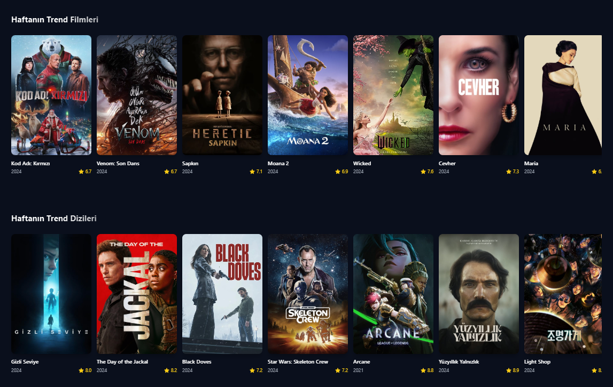

# SinemaVadi

SinemaVadi, en popüler filmleri ve dizileri keşfetmenizi sağlayan modern bir web uygulamasıdır. Kullanıcılar, trend olan içerikleri görebilir, popüler filmleri ve dizileri izleyebilir ve en iyi puan alan yapımları keşfedebilir. Public API key entegrelidir. Yine de kendiniz .env dosyası oluşturup TMDB API key ekleyebilirsiniz.
Live Demo: https://stream-vadi-dizi-film-sitesi.vercel.app

## Ekran Görüntüsü




## Özellikler

- **Trend İçerikler:** Haftanın trend filmleri ve dizileri.
- **Popüler İçerikler:** Popüler filmler ve diziler.
- **En İyi İçerikler:** En iyi puan alan filmler ve diziler.
- **Detaylı Bilgi:** Her film ve dizi için detaylı bilgi ve açıklama.
- **Arama Fonksiyonu:** Film ve dizi isimlerine göre arama yapabilme.
- **Sezon ve Bölüm Seçimi:** Diziler için sezon ve bölüm seçimi.

## Kurulum

1. Bu projeyi klonlayın:
   ```bash
   git clone https://github.com/kullanici/sinemavadi.git
   ```

2. Proje dizinine gidin:
   ```bash
   cd sinemavadi
   ```

3. Gerekli bağımlılıkları yükleyin:
   ```bash
   npm install
   ```

4. Uygulamayı başlatın:
   ```bash
   npm run dev
   ```

## Kullanım

- Uygulama başlatıldığında, ana sayfada trend, popüler ve en iyi içerikler listelenecektir.
- Arama çubuğunu kullanarak belirli bir film veya dizi arayabilirsiniz.
- İçerik kartlarına tıklayarak detaylı bilgi alabilir ve izlemeye başlayabilirsiniz.

## Teknolojiler

- **React:** Kullanıcı arayüzü için.
- **React Query:** Veri alma ve önbellekleme için.
- **Axios:** API istekleri için.
- **Tailwind CSS:** Stil ve tasarım için.
- **Vite:** Geliştirme ortamı için.